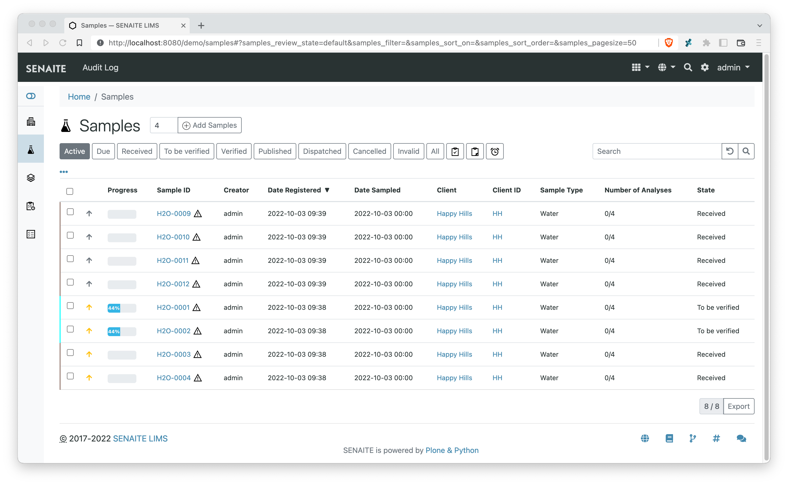
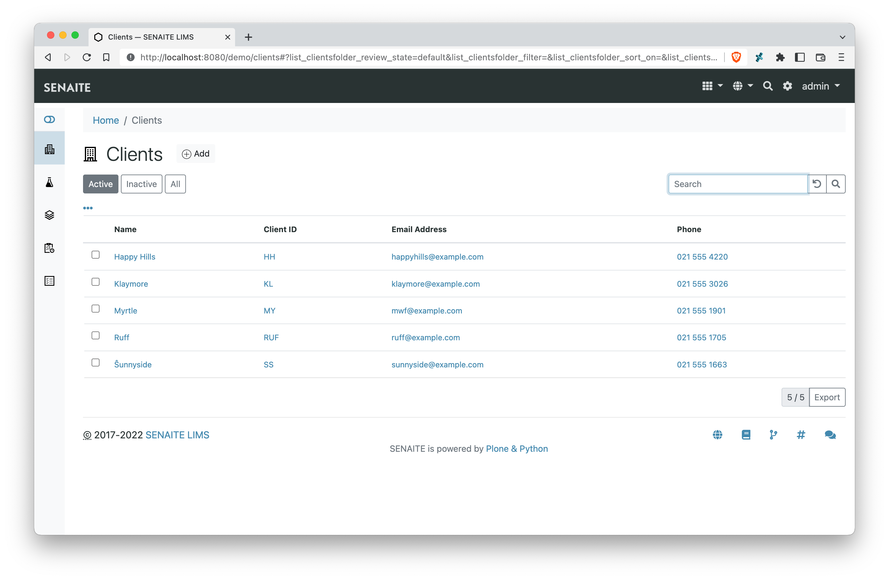

  

  
ReactJS powered listings for SENAITE

  

    
    
    
    
    
    
  

## About

This package provides a ReactJS based listing component for SENAITE.

## Screenshots

This section shows some screenshots how `senaite.core.listing` looks like.

### Samples Listing

### Worksheet Classic Listing

### Worksheet Transposed Listing

### Clients Listing

## Development

This package uses [webpack](https://webpack.js.org) to bundle all assets for the
final JavaScript file.

Used libraries:

    - ReactJS https://reactjs.org/

### Prerequisites

You need `node` and `npm` installed:

    » npm --version
    6.5.0

    » node --version
    v11.9.0

### Installation of JS Dependencies

Use `npm` (or `yarn`) to install the develoment dependencies:

    » yarn install

This creates a local node_modules directory where all the dependencies are stored.

You can now run `webpack` locally:

    » node_modules/.bin/webpack

Print usage (output below is cutted):

    » node_modules/.bin/webpack --help

    webpack-cli 3.2.1
    Usage: https://webpack.js.org/api/cli/
    Usage without config file: webpack <entry> [<entry>] --output [-o] <output>

    Initialization:
    --init             Initializes a new webpack configuration or loads a
                        addon if specified                                [boolean]

    Basic options:
    --watch, -w  Watch the filesystem for changes                        [boolean]
    -d           shortcut for --debug --devtool eval-cheap-module-source-map
                --output-pathinfo                                       [boolean]
    -p           shortcut for --optimize-minimize --define

### Building the Project for Production/Development

The following script commands which can be executed by the `npm run` command are
located in `package.json`.

The configuration for the used `webpack` command is located in `webpack.config.js`.

Run this command to watch/rebuild the JavaScript for Development:

    » npm run watch

Run this command to build the final JavaScript for Production:

    » npm run build
