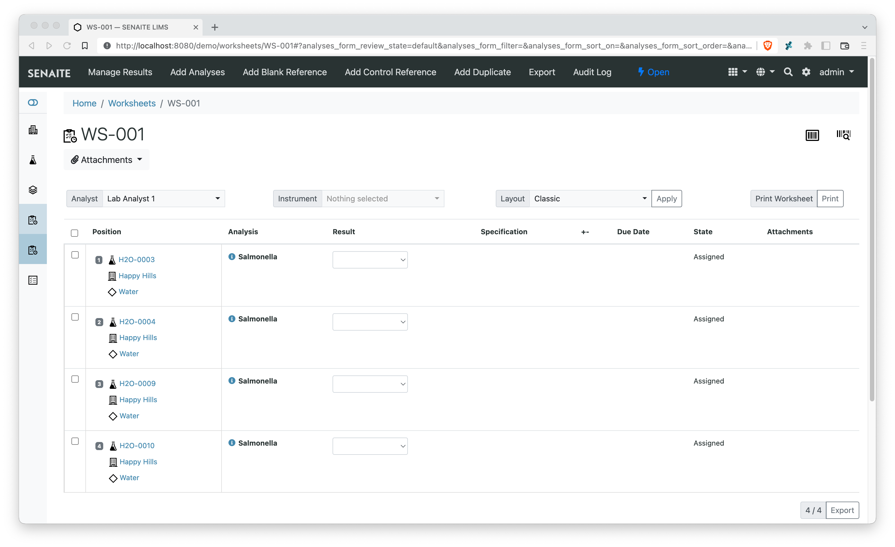
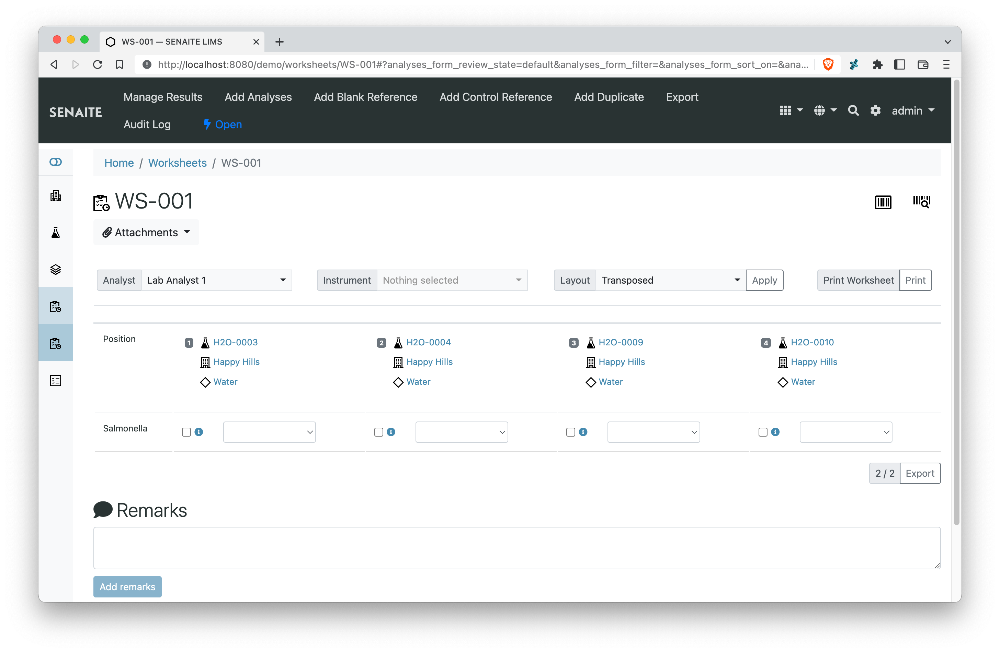

<div align="center">

  <a href="https://github.com/senaite/senaite.core.listing">
    
  </a>

  <p>ReactJS powered listing tables for SENAITE LIMS</p>

  <div>
    <a href="https://pypi.python.org/pypi/senaite.core.listing">
      
    </a>
    <a href="https://travis-ci.org/senaite/senaite.core.listing">
      
    </a>
    <a href="https://github.com/senaite/senaite.core.listing/pulls">
      
    </a>
    <a href="https://github.com/senaite/senaite.core.listing/issues">
      
    </a>
    <a href="#">
      
    </a>
    <a href="https://www.senaite.com">
      
    </a>
  </div>
</div>


## About

This package provides a [ReactJS](https://reactjs.org) based
listing tables for [SENAITE LIMS](https://www.senaite.com).

[ReactJS](https://reactjs.org/) is a declarative, efficient, and flexible
JavaScript library for building user interfaces built by
[Facebook](https://github.com/facebook/react) and is licensed under the [MIT
License](https://github.com/facebook/react/blob/master/LICENSE)


## Screenshots

This section shows some screenshots how `senaite.core.listing` looks like.


### Samples Listing


### Worksheet Classic Listing




### Worksheet Transposed Listing




### Clients Listing


## Adapting Listings

In most cases, adding a subscriber adapter for `IListingView` is enough to
extend a given listing with additional columns, status or even behavior. With
the subscriber approach, a given listing can be modified multiple times by same
or different add-ons, without the need of inheritance and dependency bindings
amongst them. More information here: https://docs.zope.org/zope.interface/adapter.html#subscriptions

For instance, imagine you have two independent add-ons (A and B),
with the following use-case:

- A adds a column "DateStored" in Samples listing, along with filter "Stored"
- B adds a column "Participant" in Samples listing, along with filter "Ordered"
- Both changes are displayed in the result listing when A and B are installed

Making B dependent on A or the other way round is not a solution. With
subscriber adapters, we can address this problem easily as follows:

### 1. Create a subscriber adapter for each add-on

The skeleton of the subscriber adapter may look like follows:

```python
from bika.lims import api
from senaite.core.listing.interfaces import IListingView
from senaite.core.listing.interfaces import IListingViewAdapter
from zope.component import adapts
from zope.component import implements


class SamplesListingViewAdapter(object):
    adapts(IListingView)
    implements(IListingViewAdapter)

    def __init__(self, listing, context):
        self.listing = listing
        self.context = context

    def before_render(self):
        self.listing.columns["MyColumn"] = {
            "title": "My new column",
        }

    def folder_item(self, obj, item, index):
        item["MyColumn"] = api.get_object(obj).getMyColumnValue()
        return item
```

### 2. Register the subscriber adapter in configure.zcml

The next thing is to tell the system to use this adapter when the context is an
`AnalysisRequestFolder` object and the listing view is `AnalysisRequestsView`.
We assume here you created the subscriber adapter inside a `samples.py` file and
the configure.zcml is in that same directory:

```
  <!-- Samples view with additional filters and columns -->
  <subscriber
    for="bika.lims.browser.analysisrequest.AnalysisRequestsView
         bika.lims.interfaces.IAnalysisRequestsFolder"
    provides="senaite.core.listing.interfaces.IListingViewAdapter"
    factory=".samples.SamplesListingViewAdapter"
  />
```

Note that `AnalysisRequestsView` (from `senaite.core`) inherits from
`senaite.core.listing`'s `ListingView`, that in turn implements `IListingView`.


## Development

This package uses [webpack](https://webpack.js.org) to bundle all assets for the
final JavaScript file.

Used libraries:

    - ReactJS https://reactjs.org/


### Prerequisites

You need `node` and `npm` installed:

    » npm --version
    6.5.0

    » node --version
    v11.9.0

### Installation of JS Dependencies

Use `npm` (or `yarn`) to install the develoment dependencies:

    » yarn install

This creates a local node_modules directory where all the dependencies are stored.


You can now run `webpack` locally:

    » node_modules/.bin/webpack

Print usage (output below is cutted):

    » node_modules/.bin/webpack --help

    webpack-cli 3.2.1
    Usage: https://webpack.js.org/api/cli/
    Usage without config file: webpack <entry> [<entry>] --output [-o] <output>

    Initialization:
    --init             Initializes a new webpack configuration or loads a
                        addon if specified                                [boolean]

    Basic options:
    --watch, -w  Watch the filesystem for changes                        [boolean]
    -d           shortcut for --debug --devtool eval-cheap-module-source-map
                --output-pathinfo                                       [boolean]
    -p           shortcut for --optimize-minimize --define


### Building the Project for Production/Development

The following script commands which can be executed by the `npm run` command are
located in `package.json`.

The configuration for the used `webpack` command is located in `webpack.config.js`.


Run this command to watch/rebuild the JavaScript for Development:

    » npm run watch

Run this command to build the final JavaScript for Production:

    » npm run build
